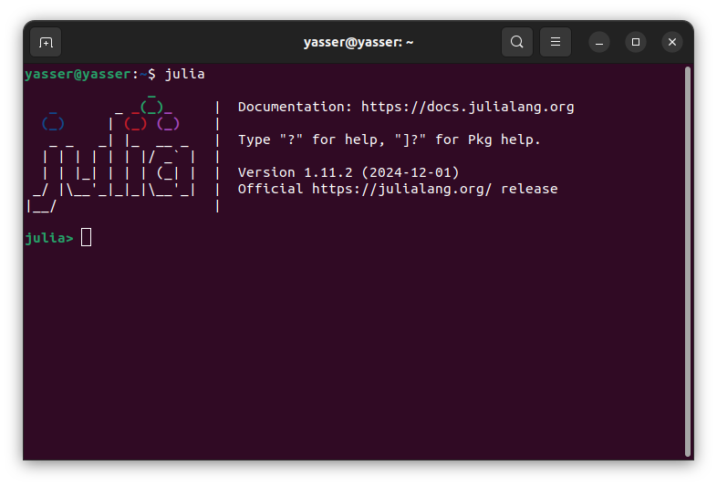
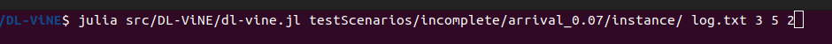
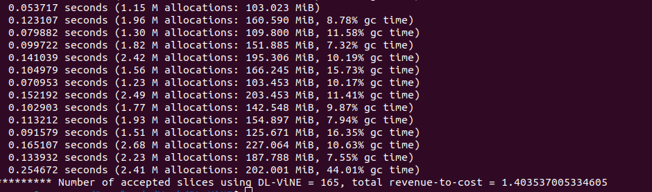

# DL-ViNE: Reinforcement Learning Algorithm for Efficient Virtual Network Embedding under Direct-Link Constraints


## Description

The rise of 5G and upcoming 6G technologies has introduced a broad spectrum of industrial and service applications with diverse Quality of Service (QoS) and resource requirements. Network Slicing has emerged as a critical paradigm to meet these demands by creating multiple logical Virtual Networks (VNs), or "slices," on shared physical infrastructures. This process, referred to as the Virtual Network Embedding (VNE) problem, involves optimally allocating resources to maximize utilization and operator benefits.

With Kubernetes becoming the leading container orchestration platform, most modern infrastructures are now hosted on Kubernetes clusters. Kubernetes enforces direct communication between pods, which necessitates a direct-link mapping approach in the VNE process. However, existing VNE solutions predominantly rely on path-based mappings and shortest-path algorithms, leaving the direct-link scenario unexplored.

DL-ViNE (Direct Link Virtual Network Embedding) addresses this gap with a novel reinforcement learning-based algorithm tailored to the direct-link constraints of Kubernetes-hosted infrastructures. By leveraging slice specifications and intelligent node selection, DL-ViNE enhances slice acceptance rates, improves resource utilization, and optimizes runtime performance.

If you use DL-ViNE or any part of this repository in your research, please **cite** the following publication (BibTeX format):

```bibtex
@inproceedings{brahmi:hal-05114918,
  TITLE = {{DL-ViNE: Reinforcement Learning Algorithm for Efficient Virtual Network Embedding under Direct-Link Constraints}},
  AUTHOR = {Brahmi, Abdenour Yasser and Aba, Massinissa Ait and Bouasker, Hadil and Jouaber, Badii and Castel-Taleb, Hind},
  URL = {https://hal.science/hal-05114918},
  BOOKTITLE = {{11th IEEE International Conference on Network Softwarization}},
  ADDRESS = {Budapest, Hungary},
  YEAR = {2025},
  MONTH = Jun,
  KEYWORDS = {5G Network Slicing RL VNE Kubernetes ; 5G ; Network Slicing ; RL ; VNE ; Kubernetes},
  PDF = {https://hal.science/hal-05114918v1/file/NetSoft_2025_DL_ViNE.pdf},
  HAL_ID = {hal-05114918},
  HAL_VERSION = {v1},
}
```


## Repository Structure

The repository is organized as follows:

- **`src/`** – Contains the implementation of **DL-ViNE** along with the baseline algorithms **NEPA** and **NRPA-DL**.
- **`testScenarios/`** – Includes test cases for **complete and incomplete SNs**, along with the Python script used for scenario generation.
- **`results/`** – Stores both **numerical (logs) and visual (plots) results**, along with the Python scripts used to generate them.


## Prerequisites

### **Julia (Required)**
DL-ViNE is implemented in **Julia**. To install Julia:  
- [Download Julia](https://julialang.org/downloads/)  

To verify installation, run:  


 
Install the required Julia packages:

```julia
import Pkg
Pkg.add(["JSON", "Graphs", "MetaGraphs", "DataStructures", "StatsBase", "Random", "Statistics", "JLD2"])
```

### Python (Optional)
Python 3.8+ is required only for:
- Generating test scenarios
- Visualizing results (plots)

Install dependencies:

```bash
pip install matplotlib networkx json
```

## Running DL-ViNE

### 1. Clone the Repository
Start by cloning this repository:
```bash
git clone https://github.com/AIDY-F2N/DL-ViNE.git
cd DL-ViNE
```

### 2. Execute DL-ViNE

```bash
julia dl-vine.jl <test scenario folder> <log file> <level> <N> <random seed>
```
Example : 
```bash
julia src/DL-ViNE/dl-vine.jl testScenarios/incomplete/arrival_0.07/instance/ log.txt 3 5 2
```



The same applies to NEPA and NRPA-DL.


## Keywords
**5G**, **Network Slicing**, **Virtual Network Embedding (VNE)**, **Reinforcement Learning (RL)**, **Kubernetes**

## Contact

**Yasser BRAHMI**  
Email: [abdenour-yasser.brahmi@telecom-sudparis.eu](mailto:abdenour-yasser.brahmi@telecom-sudparis.eu)
